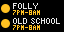
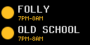

# burnsafe

burnsafe is a [Pixlet][pixlet] app for the [Tronbyt][tronbyt] that shows
today's Nova Scotia fire restriction from [BurnSafe][burnsafe] for up to two
counties. See [Tidbyt apps](https://wiki.lolwtf.ca/apps/tidbyt/).





Each site shows the page's legend colour and the hours burning is allowed:
`2PM-8AM`, `7PM-8AM` or `NO BURN`. BurnSafe has no API, so the app reads the
page's county table, where each row is `<tr id="<County>-County">` with a
`status-<level>` cell.

## Run

Render the app against a saved copy of the page. `mise install` at the repo
root supplies `pixlet`.

```bash
curl -so page.html https://novascotia.ca/burnsafe/
python3 -m http.server 8080 &
pixlet render burnsafe.star url=http://127.0.0.1:8080/page.html --format gif -o preview.gif
pixlet render -2 burnsafe.star url=http://127.0.0.1:8080/page.html --format gif -o preview@2x.gif
```

The 2x (128×64) layout scales from `canvas.is2x()`. The app has no
`sample_results.json`, so `.github/workflows/pixlet-preview.yml` renders it
against the live page.

| Field | Meaning |
| --- | --- |
| `county_1` | The first site's county, Colchester by default |
| `label_1` | The first site's name, Folly by default |
| `county_2` | The second site's county, Halifax by default, or None |
| `label_2` | The second site's name, Old School by default |

## Deploy

The Tronbyt server in `clusters/folly/apps/tronbyt/` runs the app. No manifest
in git installs `burnsafe.star` on it.

[burnsafe]: https://novascotia.ca/burnsafe/
[tronbyt]: https://github.com/tronbyt/tronbyt-server
[pixlet]: https://github.com/tronbyt/pixlet
