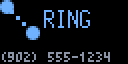

# callerid

callerid is a [Pixlet][pixlet] app for the [Tronbyt][tronbyt] that shows an
incoming call: a name or number while it rings, a red SPAM screen, or a
playful troll screen. See [Tidbyt apps](https://wiki.lolwtf.ca/apps/tidbyt/).

Unlike rackstat and tempest, callerid does not fetch anything: whatever calls
Tronbyt's `push_app` API supplies `name`, `number` and `verdict` in the push,
and the app only renders them. With no `verdict` config, it cycles a demo
through every verdict instead. Every pusher must send `verdict`, even for a
withheld caller ID: a `verdict` with no `number` still renders that verdict,
with an UNKNOWN number.




## Run

`mise install` at the repo root supplies `pixlet`.

```bash
pixlet render callerid.star --format gif -o preview.gif
pixlet render -2 callerid.star --format gif -o preview@2x.gif

# a specific call, instead of the demo
pixlet render callerid.star number=9025551234 name=Nan verdict=contact --format gif -o preview.gif
```

| Field | Meaning |
| --- | --- |
| `number` | Caller ID, digits only. Empty renders as UNKNOWN. |
| `name` | Caller name, when known. Shown instead of the number for `ring` and `contact`. |
| `verdict` | One of `ring`, `contact`, `spam`, `troll`. Unset renders the demo. |

## Deploy

The Tronbyt server in `clusters/folly/apps/tronbyt/` runs the app. No
manifest in git installs `callerid.star` on it, and nothing calls its push
endpoint yet. `.github/workflows/pixlet-preview.yml` renders a changed
`.star` file on the pull request.

[tronbyt]: https://github.com/tronbyt/tronbyt-server
[pixlet]: https://github.com/tronbyt/pixlet
