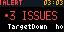
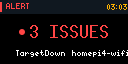

# rackstat

Rack-top homelab status for [Tronbyt][tronbyt]: a Go aggregator that condenses
Prometheus, Flux, and network probes into one JSON snapshot, plus a
[Pixlet][pixlet] app that renders it on the display sitting on the rack.



Supports 2x (128×64) displays:



## Design

The display answers one question from six feet away: *is anything wrong, and
if so, where do I start looking?* Pages are state-driven — when alerts fire or
a node/probe is down, an alert page preempts the rotation and problem rows
blink; otherwise a calm summary, node grid, GitOps state, network probes, and
a 24h CPU sparkline rotate.

Every page header carries a clock rendered in-cluster. A frozen clock means
the renderer (or the cluster under it) is down — a built-in dead man's switch.

## Aggregator (`main.go`)

Serves `/api/rackstat` and `/healthz` on `:8080`, caching snapshots for 15s.
Sources, each degrading independently:

- **Prometheus** — node up/temp/CPU/mem from the `node-exporter` job (k8s
  nodes and the bare Pis), firing alerts (excluding the always-firing
  Watchdog/InfoInhibitor), k8s readiness from kube-state-metrics, and a 24h
  cluster CPU history. Fleet membership comes from Prometheus targets, so
  hosts never need to be hardcoded.
- **Kubernetes API** — Flux Kustomization/HelmRelease readiness and the last
  applied revision, read straight from the CRDs (Flux metrics are not scraped
  into Prometheus). Needs the read-only `rackstat-flux-reader` ClusterRole.
- **TCP probes** — `PROBES=name=host:port,...`: WAN, the offsite cluster over
  the Site Magic tunnel, and a local LB VIP. Probing the data path catches
  "BGP session up but routes not programmed" failures that state metrics miss.

| Env | Default | Purpose |
| --- | --- | --- |
| `PROM_URL` | `http://prom-stack-kube-prometheus-prometheus.monitoring.svc:9090` | Prometheus base URL |
| `PROBES` | _(none)_ | comma-separated `name=host:port` TCP probes |
| `CLUSTER_NAME` | `folly` | reported in the snapshot |
| `ROOT_KUSTOMIZATION` | `apps` | whose `lastAppliedRevision` is "the repo" |
| `CACHE_TTL` | `15s` | snapshot cache |
| `LISTEN_ADDR` | `:8080` | listen address |

Deployed by Flux from `clusters/folly/apps/tronbyt/` (RBAC, Deployment,
Service) in the tronbyt namespace, next to the server that renders the app.

## Development

```bash
# aggregator against live Prometheus
kubectl --context folly -n monitoring port-forward svc/prom-stack-kube-prometheus-prometheus 9090 &
PROM_URL=http://127.0.0.1:9090 PROBES="wan=1.1.1.1:443" go run .

# pixlet app against the checked-in sample
python3 -m http.server 8080 &
pixlet render rackstat.star api_url=http://127.0.0.1:8080/sample_results.json --format gif -o preview.gif
pixlet render -2 rackstat.star api_url=http://127.0.0.1:8080/sample_results.json --format gif -o preview@2x.gif
```

The checked-in `sample_results.json` is a live capture with its
`generated_at` pinned far in the future so previews don't render the STALE
banner; it includes two down hosts and firing alerts, so previews demo the
alert-first path.

[tronbyt]: https://github.com/tronbyt/tronbyt-server
[pixlet]: https://github.com/tronbyt/pixlet
