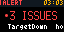
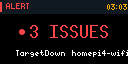

# rackstat

rackstat is the rack status display on the [Tronbyt][tronbyt]: a Go aggregator
that condenses Prometheus, Flux and TCP probes into one JSON snapshot, and a
[Pixlet][pixlet] app, `rackstat.star`, that renders it. See
[Tidbyt apps](https://wiki.lolwtf.ca/apps/tidbyt/).





## Run

The aggregator serves `/api/rackstat` and `/healthz`.

```bash
kubectl --context folly -n monitoring port-forward svc/prom-stack-kube-prometheus-prometheus 9090 &
PROM_URL=http://127.0.0.1:9090 PROBES="wan=example.com:443" go run .
```

Render the app against `sample_results.json`. The sample has a far-future
`generated_at`, a host down, firing alerts and a PBX trunk down, so a preview
shows the alert page, the phone page and no STALE banner. Flip `pbx.on_air`
to `true` in a copy of the sample to preview the ON AIR page.

```bash
python3 -m http.server 8080 &
pixlet render rackstat.star api_url=http://127.0.0.1:8080/sample_results.json --format gif -o preview.gif
pixlet render -2 rackstat.star api_url=http://127.0.0.1:8080/sample_results.json --format gif -o preview@2x.gif
```

`mise install` at the repo root supplies `pixlet`.

| Variable | Default | Meaning |
| --- | --- | --- |
| `PROM_URL` | `http://prom-stack-kube-prometheus-prometheus.monitoring.svc:9090` | Prometheus base URL |
| `PROBES` | none | Comma-separated `name=host:port` TCP probes |
| `CLUSTER_NAME` | `folly` | The cluster name in the snapshot |
| `ROOT_KUSTOMIZATION` | `apps` | The Flux Kustomization whose `lastAppliedRevision` is the repo revision |
| `CACHE_TTL` | `15s` | How long the snapshot is cached |
| `LISTEN_ADDR` | `:8080` | Listen address |

Each source fails on its own, and the snapshot keeps the others. Prometheus
supplies the nodes, alerts and CPU history, and its targets decide which hosts
appear. The Kubernetes API supplies the Flux readiness, because Prometheus does
not scrape Flux. Prometheus also supplies the office phone: each SPA504G
line's registration to the PBX, its voip.ms trunk, and whether a call is live,
read in `pbx.go` from the same series as
`clusters/folly/monitoring/pbx-rules.yaml` and the PBX Grafana dashboard. An
absent PBX degrades to every line off, the same as an absent node. `prom.go`
puts Prometheus behind the `promSource` interface, so the tests in
`fleet_test.go` and `pbx_test.go` use sample values.

## Test

```bash
go test -race ./...
```

`.github/workflows/rackstat.yml` runs `go vet` and `go test -race` on each Go
change, and `.github/workflows/pixlet-preview.yml` renders a changed `.star`
file on the pull request.

## Deploy

`.github/workflows/containers.yml` publishes `ghcr.io/jonpulsifer/rackstat`.
Flux applies `clusters/folly/apps/tronbyt/`, which holds the aggregator, its
read-only `rackstat-flux-reader` ClusterRole, and the Tronbyt server that runs
the app.

[tronbyt]: https://github.com/tronbyt/tronbyt-server
[pixlet]: https://github.com/tronbyt/pixlet
