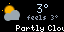

# tempest

Weather from a [WeatherFlow Tempest](https://tempestwx.com) station, for [Tidbyt][tidbyt] / [Tronbyt][tronbyt].

Written in [Starlark][starlark] and rendered with [Pixlet][pixlet].



## Pages

The app cycles through three pages:

1. **Current conditions** — animated pixel-art weather icon, temperature
   (color-coded from ice blue to red), feels-like, and a scrolling ticker with
   conditions, humidity, wind, pressure trend, UV, and lightning strikes.
2. **3-day forecast** — day, icon, high/low, and a precipitation-probability bar.
3. **Next 24 hours** — temperature plot from the hourly forecast.

## Configuration

| Field | Description |
| --- | --- |
| `station_id` | WeatherFlow Tempest station ID |
| `token` | WeatherFlow API personal access token |
| `units` | Station default, metric, or imperial |
| `show_forecast` | Toggle the 3-day forecast page |
| `show_graph` | Toggle the 24-hour temperature graph |

## Development

Render against the checked-in sample data without a token:

```bash
python3 -m http.server 8080 &
pixlet serve tempest.star   # then set api_url=http://127.0.0.1:8080/sample_results.json
# or one-shot:
pixlet render tempest.star api_url=http://127.0.0.1:8080/sample_results.json --format gif -o preview.gif
```

[tidbyt]: https://tidbyt.com/
[tronbyt]: https://github.com/tronbyt/tronbyt-server
[pixlet]: https://github.com/tronbyt/pixlet
[starlark]: https://bazel.build/rules/language
