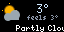
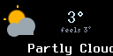

# tempest

tempest is a [Pixlet][pixlet] app for the [Tronbyt][tronbyt] that shows the
weather from a [WeatherFlow Tempest](https://tempestwx.com) station: current
conditions, a 3-day forecast and the next 24 hours. See
[Tidbyt apps](https://wiki.lolwtf.ca/apps/tidbyt/).





## Run

Render the app against `sample_results.json`, with no token. `mise install` at
the repo root supplies `pixlet`.

```bash
python3 -m http.server 8080 &
pixlet serve tempest.star   # then set api_url=http://127.0.0.1:8080/sample_results.json
pixlet render tempest.star api_url=http://127.0.0.1:8080/sample_results.json --format gif -o preview.gif
pixlet render -2 tempest.star api_url=http://127.0.0.1:8080/sample_results.json --format gif -o preview@2x.gif
```

The 2x (128×64) layout scales from `canvas.is2x()`.

| Field | Meaning |
| --- | --- |
| `station_id` | The Tempest station ID |
| `token` | A WeatherFlow personal access token |
| `units` | Station default, metric or imperial |
| `show_forecast` | Shows the 3-day forecast page |
| `show_graph` | Shows the 24-hour temperature graph |

## Deploy

The Tronbyt server in `clusters/folly/apps/tronbyt/` runs the app. No
manifest in git installs `tempest.star` on it. `.github/workflows/pixlet-preview.yml`
renders a changed `.star` file on the pull request.

[tronbyt]: https://github.com/tronbyt/tronbyt-server
[pixlet]: https://github.com/tronbyt/pixlet
