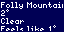

# tidbyt

The little applications I built for my [Tidbyt][tidbyt] (formerly the standalone `litebrite` repo).

The applications are written in [Starlark][starlark] and compiled with [Pixlet][pixlet]. Learn more at [tidbyt.dev](https://tidbyt.dev/).

## Applications

| App | Description | Preview |
|:---|:-----------|:----|
| wishin | stats from wishin.app |  |
| tempest | weather from tempestwx.com |  |

[tidbyt]: https://tidbyt.com/
[pixlet]: https://github.com/tidbyt/pixlet
[starlark]: https://bazel.build/rules/language
