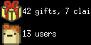

# wishin

Stats from [wishin.app](https://wishin.app), for [Tidbyt][tidbyt] / [Tronbyt][tronbyt].

Written in [Starlark][starlark] and rendered with [Pixlet][pixlet].


Supports 2x (128×64) displays — the embedded icons are high-res PNGs, so they
render with full detail:



## Development

Render against the checked-in sample data instead of the live API:

```bash
python3 -m http.server 8080 &
pixlet render wishin.star api_url=http://127.0.0.1:8080/sample_results.json --format gif -o preview.gif
# 2x (128x64):
pixlet render -2 wishin.star api_url=http://127.0.0.1:8080/sample_results.json --format gif -o preview@2x.gif
```

The `api_url` schema field is also how the pixlet-preview CI workflow renders
this app deterministically on PRs.

[tidbyt]: https://tidbyt.com/
[tronbyt]: https://github.com/tronbyt/tronbyt-server
[pixlet]: https://github.com/tronbyt/pixlet
[starlark]: https://bazel.build/rules/language
