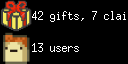

# wishin

wishin is a [Pixlet][pixlet] app for the [Tronbyt][tronbyt] that shows stats
from [wishin.app](https://wishin.app). See
[Tidbyt apps](https://wiki.lolwtf.ca/apps/tidbyt/).




## Run

Render the app against `sample_results.json` in place of the live API.
`mise install` at the repo root supplies `pixlet`.

```bash
python3 -m http.server 8080 &
pixlet render wishin.star api_url=http://127.0.0.1:8080/sample_results.json --format gif -o preview.gif
pixlet render -2 wishin.star api_url=http://127.0.0.1:8080/sample_results.json --format gif -o preview@2x.gif
```

The `api_url` field also lets `.github/workflows/pixlet-preview.yml` render the
app from the sample on each pull request that changes it.

## Deploy

The Tronbyt server in `clusters/folly/apps/tronbyt/` runs the app. No manifest
in git installs `wishin.star` on it.

[tronbyt]: https://github.com/tronbyt/tronbyt-server
[pixlet]: https://github.com/tronbyt/pixlet
