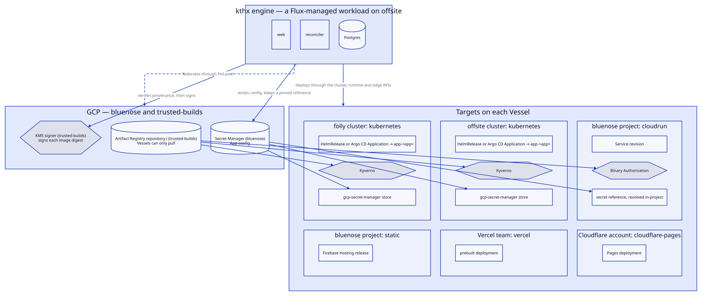

A built app is an App that [kthx](../kthx.md) builds from a GitHub repository or an uploaded archive, signs, and deploys. The owner and agents manage them in the console and over MCP.

## Concepts

| Noun | Meaning |
| --- | --- |
| App | A source and the Components deployed from it |
| Component | A `service`, `website` or `job` in an App |
| Vessel | A cluster, GCP project, Vercel team or Cloudflare account, created by OpenTofu |
| Target | One runtime on a Vessel, where a Component runs |
| Build | One run of a build route. Its Artifact is an image digest or a file tree. |
| Deploy | An Artifact and config applied to a Target |
| Datastore | A Postgres or Valkey instance for Apps |
| Function | A JavaScript `fetch` handler on Workers or Cloud Run, with no Build or Deploy |

## Targets

| Target | Vessel | A Deploy creates |
| --- | --- | --- |
| `kubernetes` | folly or offsite | A `spindrift-app` HelmRelease or an Argo CD Application that installs into `app-<app>` |
| `cloudrun` | bluenose | A Cloud Run service or job |
| `static` | bluenose | A Firebase Hosting release |
| `vercel` | Vercel team | A prebuilt deployment |
| `cloudflare-pages` | Cloudflare account | A Pages deployment |

A Target's console page lists each missing prerequisite and the OpenTofu code that adds it, which kthx can open as a pull request. Disconnecting a Target stops deploys to it and leaves its workloads running.

Deleting an App deletes its namespace. Removing a `static` Component spends its Firebase Hosting site id, so a redeploy needs a new App or Component name.

## Builds

A Build uses the first route, in Settings rank order, whose SLSA (Supply-chain Levels for Software Artifacts) build level meets the Target's minimum, 2 by default. An App can pin one route.

| Route | Level | Runs on |
| --- | --- | --- |
| `github-actions` | 2 | `.github/workflows/spindrift-build.yml` |
| `cloud-build` | 3 | Cloud Build |
| `in-cluster` | 1 | A Job in `spindrift-build` on offsite |
| `bosun` | 2 | [Bosun](../bosun.md), which is parked |

## Addresses and config

A Component's `reach` is `none`, `private` or `public`. [Ingress and DNS](../../platform/network/ingress-and-dns.md) covers the records and zones. `auth: proxy` adds oauth2-proxy, which admits only the owner's GitHub login.

`<app>.lolwtf.dev` shows a status page until a Component serves it. kthx writes the record of an App on a zone apex once, and cannot change or delete it.

kthx writes config values to Secret Manager in bluenose, and each Target reads them from there ([Secrets](../../platform/secrets.md)).

Function env values are write-only, but Cloud Run shows them to bluenose readers. Workers Functions need the Cloudflare token scopes in `terraform/network/cloudflare/spindrift.tf`.
