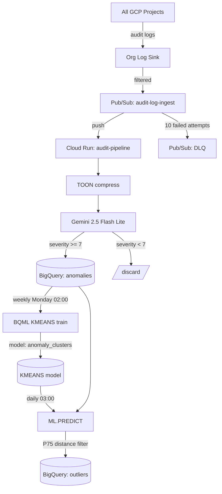

# audit-pipeline

LLM-powered GCP audit log anomaly detection. An org-level log sink routes audit logs through Pub/Sub to this Cloud Run Go service, which compresses logs into TOON format, calls Vertex AI Gemini 2.5 Flash Lite for anomaly scoring, and writes high-severity results to BigQuery. A BQML KMEANS model clusters anomalies and a daily scheduled query surfaces behavioral outliers.

## Data Flow



## Deploy

```bash
gcloud run deploy audit-pipeline \
  --source . \
  --project lolcorp \
  --region us-central1
```

## Verify

```bash
# Check for incoming messages
gcloud run services logs read audit-pipeline --project lolcorp --region us-central1

# Check DLQ is empty
gcloud pubsub subscriptions pull audit-log-dlq-pull --project lolcorp --auto-ack

# Recent anomalies
bq query --project_id=lolcorp --nouse_legacy_sql \
  'SELECT detected_at, principal_email, method_name, severity_score, anomaly_type, explanation
   FROM audit_anomalies.anomalies
   ORDER BY detected_at DESC
   LIMIT 10'

# Recent outliers (populated daily by scheduled query)
bq query --project_id=lolcorp --nouse_legacy_sql \
  'SELECT cluster_id, outlier_distance, detected_at, principal_email, method_name, anomaly_type
   FROM audit_anomalies.outliers
   ORDER BY outlier_distance DESC
   LIMIT 10'

# Generate a test audit event
gcloud projects get-iam-policy lolcorp
```

## BQML Anomaly Clusters

The KMEANS model in `sql/tuning.sql` trains weekly (Monday 02:00 UTC). It clusters anomalies into 5 behavioral groups by time-of-day, day-of-week, severity, anomaly type, and principal.

The daily predict query in `sql/predict.sql` runs at 03:00 UTC, classifies the last 24h of anomalies, and writes those above the 75th percentile of centroid distance to `audit_anomalies.outliers`.

Both need data before they do anything useful — queries below will fail until anomalies start flowing in and the first training run completes.

### Try it: classify recent anomalies into clusters

```sql
SELECT
  CENTROID_ID AS cluster_id,
  NEAREST_CENTROIDS_DISTANCE[OFFSET(0)].DISTANCE AS outlier_distance,
  detected_at,
  principal_email,
  method_name,
  severity_score,
  anomaly_type,
  explanation
FROM ML.PREDICT(MODEL `audit_anomalies.anomaly_clusters`,
  (SELECT
    EXTRACT(HOUR FROM detected_at)      AS hour_of_day,
    EXTRACT(DAYOFWEEK FROM detected_at)  AS day_of_week,
    severity_score,
    FARM_FINGERPRINT(anomaly_type)       AS anomaly_type_encoded,
    FARM_FINGERPRINT(principal_email)    AS principal_hash,
    detected_at,
    principal_email,
    method_name,
    anomaly_type,
    explanation
  FROM `audit_anomalies.anomalies`
  WHERE detected_at >= TIMESTAMP_SUB(CURRENT_TIMESTAMP(), INTERVAL 1 DAY))
)
ORDER BY outlier_distance DESC;
```

### Try it: find high-distance outliers (what the scheduled query does)

Same as `sql/predict.sql` but as a standalone SELECT:

```sql
WITH predictions AS (
  SELECT
    CENTROID_ID AS cluster_id,
    NEAREST_CENTROIDS_DISTANCE[OFFSET(0)].DISTANCE AS outlier_distance,
    detected_at,
    principal_email,
    method_name,
    resource_name,
    project_id,
    severity_score,
    anomaly_type,
    explanation
  FROM ML.PREDICT(MODEL `audit_anomalies.anomaly_clusters`,
    (SELECT
      EXTRACT(HOUR FROM detected_at)      AS hour_of_day,
      EXTRACT(DAYOFWEEK FROM detected_at)  AS day_of_week,
      severity_score,
      FARM_FINGERPRINT(anomaly_type)       AS anomaly_type_encoded,
      FARM_FINGERPRINT(principal_email)    AS principal_hash,
      detected_at,
      principal_email,
      method_name,
      resource_name,
      project_id,
      anomaly_type,
      explanation
    FROM `audit_anomalies.anomalies`
    WHERE detected_at >= TIMESTAMP_SUB(CURRENT_TIMESTAMP(), INTERVAL 1 DAY))
  )
)
SELECT * FROM predictions
WHERE outlier_distance > (
  SELECT APPROX_QUANTILES(outlier_distance, 4)[OFFSET(3)] FROM predictions
)
ORDER BY outlier_distance DESC;
```

### Inspect cluster centroids

Shows the center of each cluster so you can label them (e.g. "weekend off-hours activity", "routine weekday noise").

```sql
SELECT *
FROM ML.CENTROIDS(MODEL `audit_anomalies.anomaly_clusters`)
ORDER BY centroid_id;
```

### Cluster summary stats

```sql
SELECT
  CENTROID_ID AS cluster_id,
  COUNT(*) AS anomaly_count,
  AVG(severity_score) AS avg_severity,
  APPROX_TOP_COUNT(anomaly_type, 1)[OFFSET(0)].value AS top_anomaly_type,
  APPROX_TOP_COUNT(principal_email, 1)[OFFSET(0)].value AS top_principal
FROM ML.PREDICT(MODEL `audit_anomalies.anomaly_clusters`,
  (SELECT
    EXTRACT(HOUR FROM detected_at)      AS hour_of_day,
    EXTRACT(DAYOFWEEK FROM detected_at)  AS day_of_week,
    severity_score,
    FARM_FINGERPRINT(anomaly_type)       AS anomaly_type_encoded,
    FARM_FINGERPRINT(principal_email)    AS principal_hash,
    anomaly_type,
    principal_email
  FROM `audit_anomalies.anomalies`
  WHERE detected_at >= TIMESTAMP_SUB(CURRENT_TIMESTAMP(), INTERVAL 30 DAY))
)
GROUP BY cluster_id
ORDER BY avg_severity DESC;
```

### Evaluate model quality

```sql
SELECT * FROM ML.EVALUATE(MODEL `audit_anomalies.anomaly_clusters`);
```

Returns Davies-Bouldin index and mean squared distance — lower is better for both.

## Environment Variables

| Variable | Default | Description |
|---|---|---|
| `PORT` | `8080` | HTTP listen port |
| `GCP_PROJECT` | | GCP project ID |
| `BQ_DATASET` | `audit_anomalies` | BigQuery dataset |
| `BQ_TABLE` | `anomalies` | BigQuery table |
| `VERTEX_LOCATION` | `us-central1` | Vertex AI region |
| `VERTEX_MODEL` | `gemini-2.5-flash-lite` | Gemini model name |
| `SEVERITY_THRESHOLD` | `7` | Minimum score to write to BigQuery (1-10) |

## Error Handling

- Malformed/unparseable messages: returns `200` (ACK) to prevent infinite Pub/Sub retries
- Transient failures (Gemini, BigQuery): returns `500` so Pub/Sub retries with exponential backoff (10s-600s)
- After 10 failed delivery attempts, messages go to the `audit-log-dlq` dead letter topic

## Free Tier

| Service | Free Tier | Protection |
|---|---|---|
| Pub/Sub | 10 GB/mo | 3 exclusion filters on org sink; DLQ prevents retry storms |
| BigQuery | 1 TiB queries, 10 GB storage | DAY partition + clustering; 90-day expiration; only high-severity writes |
| Cloud Run | 2M req, 360K vCPU-s | Scale-to-zero, cpu_idle, max 2 instances, internal-only |
| BQML | 10 TB training/mo | 5-cluster KMEANS on 5 features is tiny |
| Vertex AI | Pay-per-use | Fast-path Go filter skips benign ops; Flash Lite is cheapest Gemini tier |
