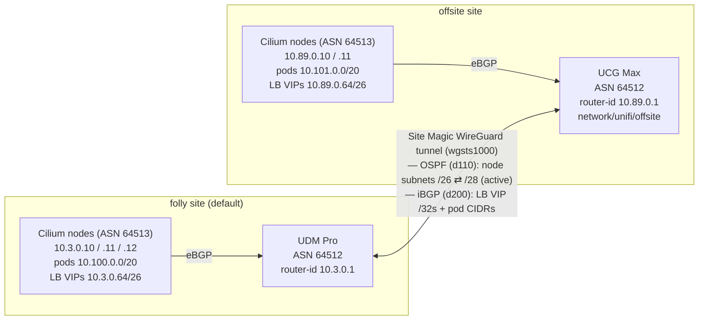

# UniFi network

Terraform for the primary UniFi side of the homelab: networks/VLANs, WLANs,
WAN, client QoS, DNS, firewall policies, and the folly gateway's BGP/FRR config
(`unifi_bgp`, sourced from `bgp-folly.conf`).

The offsite UniFi console is managed separately under `network/unifi/offsite/`.

## BGP topology

Each site runs Cilium (ASN 64513) on its k8s nodes, peering **eBGP** with the
local UniFi gateway (ASN 64512) to announce its pod and LoadBalancer IP pools.

Cross-site there are **two planes over the same Site Magic WireGuard tunnel
(`wgsts1000`)**:

- **OSPF (Site Magic, distance 110)** auto-carries the node subnets
  (`10.3.0.0/26` ⇄ `10.89.0.0/28`). This is the *active* path for node-to-node
  traffic — it beats iBGP on administrative distance.
- **iBGP between the gateways (distance 200)**, sourced from the LAN router-ids
  (`update-source`), carries the things OSPF does *not* share: the Cilium
  LoadBalancer `/32` VIPs (from the `*.64/26` pools) and the pod CIDRs
  (`10.100.0.0/20` / `10.101.0.0/20`). The node-subnet prefixes are also
  advertised here but stay inactive behind OSPF; the `/32` VIPs win on
  longest-prefix match, so cross-site Service access rides BGP.

<!-- BEGIN_TF_DOCS -->
## Requirements

| Name | Version |
| ---- | ------- |
|  [cloudflare](#requirement\_cloudflare) | ~> 5.1 |
|  [onepassword](#requirement\_onepassword) | ~> 3.0 |
|  [unifi](#requirement\_unifi) | ~> 0.53 |

## Providers

| Name | Version |
| ---- | ------- |
|  [cloudflare](#provider\_cloudflare) | 5.21.1 |
|  [onepassword](#provider\_onepassword) | 3.3.1 |
|  [unifi](#provider\_unifi) | 0.53.0 |

## Modules

No modules.

## Resources

| Name | Type |
| ---- | ---- |
| [cloudflare_dns_record.k8s_remote_dns](https://registry.terraform.io/providers/cloudflare/cloudflare/latest/docs/resources/dns_record) | resource |
| [cloudflare_dns_record.lab_remote_dns](https://registry.terraform.io/providers/cloudflare/cloudflare/latest/docs/resources/dns_record) | resource |
| [unifi_bgp.folly](https://registry.terraform.io/providers/ubiquiti-community/unifi/latest/docs/resources/bgp) | resource |
| [unifi_client_qos_rate.iot](https://registry.terraform.io/providers/ubiquiti-community/unifi/latest/docs/resources/client_qos_rate) | resource |
| [unifi_client_qos_rate.streaming](https://registry.terraform.io/providers/ubiquiti-community/unifi/latest/docs/resources/client_qos_rate) | resource |
| [unifi_client_qos_rate.unmetered](https://registry.terraform.io/providers/ubiquiti-community/unifi/latest/docs/resources/client_qos_rate) | resource |
| [unifi_firewall_group.teleport_cidr](https://registry.terraform.io/providers/ubiquiti-community/unifi/latest/docs/resources/firewall_group) | resource |
| [unifi_firewall_policy.allow_established_related_external](https://registry.terraform.io/providers/ubiquiti-community/unifi/latest/docs/resources/firewall_policy) | resource |
| [unifi_firewall_policy.allow_established_related_hotspot](https://registry.terraform.io/providers/ubiquiti-community/unifi/latest/docs/resources/firewall_policy) | resource |
| [unifi_firewall_policy.allow_established_related_internal](https://registry.terraform.io/providers/ubiquiti-community/unifi/latest/docs/resources/firewall_policy) | resource |
| [unifi_firewall_policy.allow_established_related_vpn](https://registry.terraform.io/providers/ubiquiti-community/unifi/latest/docs/resources/firewall_policy) | resource |
| [unifi_firewall_policy.drop_invalid_external](https://registry.terraform.io/providers/ubiquiti-community/unifi/latest/docs/resources/firewall_policy) | resource |
| [unifi_firewall_policy.drop_invalid_hotspot](https://registry.terraform.io/providers/ubiquiti-community/unifi/latest/docs/resources/firewall_policy) | resource |
| [unifi_firewall_policy.drop_invalid_internal](https://registry.terraform.io/providers/ubiquiti-community/unifi/latest/docs/resources/firewall_policy) | resource |
| [unifi_firewall_policy.drop_invalid_vpn](https://registry.terraform.io/providers/ubiquiti-community/unifi/latest/docs/resources/firewall_policy) | resource |
| [unifi_firewall_policy.folly_k8s_to_nest_k8s](https://registry.terraform.io/providers/ubiquiti-community/unifi/latest/docs/resources/firewall_policy) | resource |
| [unifi_firewall_policy.internal_to_lab](https://registry.terraform.io/providers/ubiquiti-community/unifi/latest/docs/resources/firewall_policy) | resource |
| [unifi_firewall_policy.internal_to_nest_k8s](https://registry.terraform.io/providers/ubiquiti-community/unifi/latest/docs/resources/firewall_policy) | resource |
| [unifi_firewall_policy.lab_to_lab](https://registry.terraform.io/providers/ubiquiti-community/unifi/latest/docs/resources/firewall_policy) | resource |
| [unifi_firewall_policy.nest_k8s_to_folly_k8s](https://registry.terraform.io/providers/ubiquiti-community/unifi/latest/docs/resources/firewall_policy) | resource |
| [unifi_firewall_policy.prometheus_windows_exporters](https://registry.terraform.io/providers/ubiquiti-community/unifi/latest/docs/resources/firewall_policy) | resource |
| [unifi_firewall_policy.teleport_cidr_to_lab](https://registry.terraform.io/providers/ubiquiti-community/unifi/latest/docs/resources/firewall_policy) | resource |
| [unifi_firewall_zone.lab](https://registry.terraform.io/providers/ubiquiti-community/unifi/latest/docs/resources/firewall_zone) | resource |
| [unifi_network.fml](https://registry.terraform.io/providers/ubiquiti-community/unifi/latest/docs/resources/network) | resource |
| [unifi_network.future](https://registry.terraform.io/providers/ubiquiti-community/unifi/latest/docs/resources/network) | resource |
| [unifi_network.iot](https://registry.terraform.io/providers/ubiquiti-community/unifi/latest/docs/resources/network) | resource |
| [unifi_network.k8s](https://registry.terraform.io/providers/ubiquiti-community/unifi/latest/docs/resources/network) | resource |
| [unifi_network.lab](https://registry.terraform.io/providers/ubiquiti-community/unifi/latest/docs/resources/network) | resource |
| [unifi_static_route.starlink](https://registry.terraform.io/providers/ubiquiti-community/unifi/latest/docs/resources/static_route) | resource |
| [unifi_wan.starlink](https://registry.terraform.io/providers/ubiquiti-community/unifi/latest/docs/resources/wan) | resource |
| [unifi_wlan.fml](https://registry.terraform.io/providers/ubiquiti-community/unifi/latest/docs/resources/wlan) | resource |
| [unifi_wlan.lab](https://registry.terraform.io/providers/ubiquiti-community/unifi/latest/docs/resources/wlan) | resource |
| [cloudflare_zone.lab](https://registry.terraform.io/providers/cloudflare/cloudflare/latest/docs/data-sources/zone) | data source |
| [onepassword_item.wifi](https://registry.terraform.io/providers/1password/onepassword/latest/docs/data-sources/item) | data source |
| [unifi_ap_group.all_aps](https://registry.terraform.io/providers/ubiquiti-community/unifi/latest/docs/data-sources/ap_group) | data source |
| [unifi_firewall_zone.external](https://registry.terraform.io/providers/ubiquiti-community/unifi/latest/docs/data-sources/firewall_zone) | data source |
| [unifi_firewall_zone.hotspot](https://registry.terraform.io/providers/ubiquiti-community/unifi/latest/docs/data-sources/firewall_zone) | data source |
| [unifi_firewall_zone.internal](https://registry.terraform.io/providers/ubiquiti-community/unifi/latest/docs/data-sources/firewall_zone) | data source |
| [unifi_firewall_zone.vpn](https://registry.terraform.io/providers/ubiquiti-community/unifi/latest/docs/data-sources/firewall_zone) | data source |
| [unifi_network.nest](https://registry.terraform.io/providers/ubiquiti-community/unifi/latest/docs/data-sources/network) | data source |

## Inputs

No inputs.

## Outputs

No outputs.
<!-- END_TF_DOCS -->
