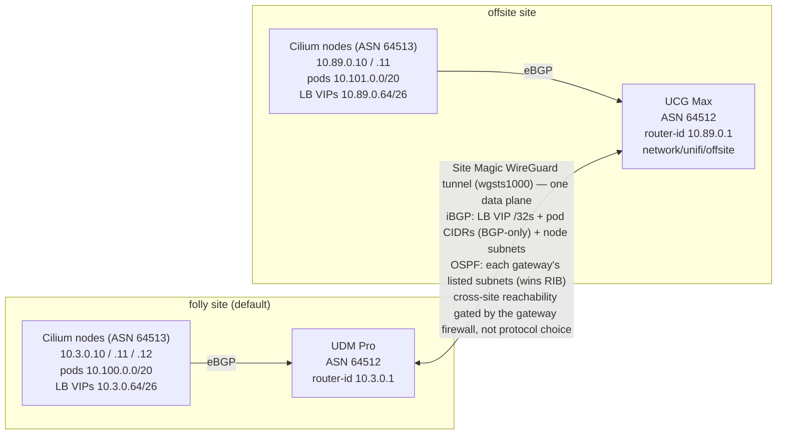

# UniFi network

Terraform for the primary UniFi side of the homelab: networks/VLANs, WLANs,
WAN, client QoS, DNS, firewall policies, and the folly gateway's BGP/FRR config
(`unifi_bgp`, sourced from `bgp-folly.conf`).

The offsite UniFi console is managed separately under `network/unifi/offsite/`.

## BGP topology

Each site runs Cilium (ASN 64513) on its k8s nodes, peering **eBGP** with the
local UniFi gateway (ASN 64512) to announce its pod and LoadBalancer IP pools.

There is a **single inter-site data plane**: the Site Magic WireGuard tunnel
(`wgsts1000`). Two control-plane protocols run over it, but both next-hops
resolve *through that same tunnel*, so they are not separate paths:

- **iBGP between the gateways** (sourced from the LAN router-ids via
  `update-source`) is the **only** way the Cilium LoadBalancer `/32` VIPs (from
  the `*.64/26` pools) and the pod CIDRs (`10.100.0.0/20` / `10.101.0.0/20`)
  cross the sites — OSPF/Site Magic does not carry them.
- **OSPF (Site Magic)** carries the subnets each gateway's Site Magic config
  lists and wins the RIB for them — folly advertises `10.3.0.0/26` and
  `10.13.37.0/28`, and installs `10.89.0.0/28` and `192.168.1.0/24` from
  offsite; the iBGP copy of the node subnet is an inactive
  (recursive-next-hop) backup.

Because there is only one tunnel, cross-site **reachability does not depend on
which protocol wins the RIB** — it depends on the **gateway firewall**. The
folly gateway isolates its k8s network in a custom **`Lab`** zone
(`firewall.tf`), and it picks a forward chain from the **destination's** zone
while deciding the source zone by ingress interface.

A zone holds only the subnets of *declared* networks, so the BGP-learned LB VIP
pool and pod CIDR are in no zone. That makes the two halves of each cross-site
policy behave differently: the **pod CIDRs and LB VIP pools are load-bearing as
sources** — omit them and pod-sourced packets hit the `Lab → Vpn` chain's
closing `DROP` — while as **destinations** only the node CIDR dispatches, and
traffic to a VIP or pod takes the `→ WAN` fall-through instead. See the comment
above `locals` in `firewall.tf`; `docs/pages/Architecture___Networking.md`
carries the full reasoning and why closing the inbound gap is not worth it.

The offsite console has **no custom firewall policies** — its k8s network sits
in the default `Internal` zone, whose predefined `Internal ⇄ Vpn` rules already
permit the traffic.

<!-- BEGIN_TF_DOCS -->
## Requirements

| Name | Version |
| ---- | ------- |
|  [cloudflare](#requirement\_cloudflare) | ~> 5.1 |
|  [onepassword](#requirement\_onepassword) | ~> 3.0 |
|  [unifi](#requirement\_unifi) | ~> 0.55 |

## Providers

| Name | Version |
| ---- | ------- |
|  [cloudflare](#provider\_cloudflare) | 5.24.0 |
|  [onepassword](#provider\_onepassword) | 3.3.1 |
|  [unifi](#provider\_unifi) | 0.55.0 |

## Modules

| Name | Source | Version |
| ---- | ------ | ------- |
|  [lab\_topology](#module\_lab\_topology) | ../../../modules/cluster-topology | n/a |
|  [offsite\_topology](#module\_offsite\_topology) | ../../../modules/cluster-topology | n/a |
|  [topology](#module\_topology) | ../../../modules/cluster-topology | n/a |

## Resources

| Name | Type |
| ---- | ---- |
| [cloudflare_dns_record.k8s_remote_dns](https://registry.terraform.io/providers/cloudflare/cloudflare/latest/docs/resources/dns_record) | resource |
| [cloudflare_dns_record.lab_remote_dns](https://registry.terraform.io/providers/cloudflare/cloudflare/latest/docs/resources/dns_record) | resource |
| [cloudflare_dns_record.lab_service_dns](https://registry.terraform.io/providers/cloudflare/cloudflare/latest/docs/resources/dns_record) | resource |
| [unifi_bgp.folly](https://registry.terraform.io/providers/ubiquiti-community/unifi/latest/docs/resources/bgp) | resource |
| [unifi_client_qos_rate.iot](https://registry.terraform.io/providers/ubiquiti-community/unifi/latest/docs/resources/client_qos_rate) | resource |
| [unifi_client_qos_rate.streaming](https://registry.terraform.io/providers/ubiquiti-community/unifi/latest/docs/resources/client_qos_rate) | resource |
| [unifi_client_qos_rate.unmetered](https://registry.terraform.io/providers/ubiquiti-community/unifi/latest/docs/resources/client_qos_rate) | resource |
| [unifi_firewall_group.teleport_cidr](https://registry.terraform.io/providers/ubiquiti-community/unifi/latest/docs/resources/firewall_group) | resource |
| [unifi_firewall_policy.allow_established_related_external](https://registry.terraform.io/providers/ubiquiti-community/unifi/latest/docs/resources/firewall_policy) | resource |
| [unifi_firewall_policy.allow_established_related_hotspot](https://registry.terraform.io/providers/ubiquiti-community/unifi/latest/docs/resources/firewall_policy) | resource |
| [unifi_firewall_policy.allow_established_related_internal](https://registry.terraform.io/providers/ubiquiti-community/unifi/latest/docs/resources/firewall_policy) | resource |
| [unifi_firewall_policy.allow_established_related_vpn](https://registry.terraform.io/providers/ubiquiti-community/unifi/latest/docs/resources/firewall_policy) | resource |
| [unifi_firewall_policy.drop_invalid_external](https://registry.terraform.io/providers/ubiquiti-community/unifi/latest/docs/resources/firewall_policy) | resource |
| [unifi_firewall_policy.drop_invalid_hotspot](https://registry.terraform.io/providers/ubiquiti-community/unifi/latest/docs/resources/firewall_policy) | resource |
| [unifi_firewall_policy.drop_invalid_internal](https://registry.terraform.io/providers/ubiquiti-community/unifi/latest/docs/resources/firewall_policy) | resource |
| [unifi_firewall_policy.drop_invalid_vpn](https://registry.terraform.io/providers/ubiquiti-community/unifi/latest/docs/resources/firewall_policy) | resource |
| [unifi_firewall_policy.folly_k8s_to_nest_k8s](https://registry.terraform.io/providers/ubiquiti-community/unifi/latest/docs/resources/firewall_policy) | resource |
| [unifi_firewall_policy.internal_to_lab](https://registry.terraform.io/providers/ubiquiti-community/unifi/latest/docs/resources/firewall_policy) | resource |
| [unifi_firewall_policy.internal_to_nest_k8s](https://registry.terraform.io/providers/ubiquiti-community/unifi/latest/docs/resources/firewall_policy) | resource |
| [unifi_firewall_policy.lab_clients_to_nest_k8s](https://registry.terraform.io/providers/ubiquiti-community/unifi/latest/docs/resources/firewall_policy) | resource |
| [unifi_firewall_policy.lab_to_lab](https://registry.terraform.io/providers/ubiquiti-community/unifi/latest/docs/resources/firewall_policy) | resource |
| [unifi_firewall_policy.nest_k8s_to_folly_k8s](https://registry.terraform.io/providers/ubiquiti-community/unifi/latest/docs/resources/firewall_policy) | resource |
| [unifi_firewall_policy.prometheus_windows_exporters](https://registry.terraform.io/providers/ubiquiti-community/unifi/latest/docs/resources/firewall_policy) | resource |
| [unifi_firewall_policy.teleport_cidr_to_lab](https://registry.terraform.io/providers/ubiquiti-community/unifi/latest/docs/resources/firewall_policy) | resource |
| [unifi_firewall_zone.lab](https://registry.terraform.io/providers/ubiquiti-community/unifi/latest/docs/resources/firewall_zone) | resource |
| [unifi_network.fml](https://registry.terraform.io/providers/ubiquiti-community/unifi/latest/docs/resources/network) | resource |
| [unifi_network.future](https://registry.terraform.io/providers/ubiquiti-community/unifi/latest/docs/resources/network) | resource |
| [unifi_network.iot](https://registry.terraform.io/providers/ubiquiti-community/unifi/latest/docs/resources/network) | resource |
| [unifi_network.k8s](https://registry.terraform.io/providers/ubiquiti-community/unifi/latest/docs/resources/network) | resource |
| [unifi_network.lab](https://registry.terraform.io/providers/ubiquiti-community/unifi/latest/docs/resources/network) | resource |
| [unifi_static_route.starlink](https://registry.terraform.io/providers/ubiquiti-community/unifi/latest/docs/resources/static_route) | resource |
| [unifi_wan.starlink](https://registry.terraform.io/providers/ubiquiti-community/unifi/latest/docs/resources/wan) | resource |
| [unifi_wlan.fml](https://registry.terraform.io/providers/ubiquiti-community/unifi/latest/docs/resources/wlan) | resource |
| [unifi_wlan.lab](https://registry.terraform.io/providers/ubiquiti-community/unifi/latest/docs/resources/wlan) | resource |
| [cloudflare_zone.lab](https://registry.terraform.io/providers/cloudflare/cloudflare/latest/docs/data-sources/zone) | data source |
| [onepassword_item.wifi](https://registry.terraform.io/providers/1password/onepassword/latest/docs/data-sources/item) | data source |
| [unifi_ap_group.all_aps](https://registry.terraform.io/providers/ubiquiti-community/unifi/latest/docs/data-sources/ap_group) | data source |
| [unifi_firewall_zone.external](https://registry.terraform.io/providers/ubiquiti-community/unifi/latest/docs/data-sources/firewall_zone) | data source |
| [unifi_firewall_zone.hotspot](https://registry.terraform.io/providers/ubiquiti-community/unifi/latest/docs/data-sources/firewall_zone) | data source |
| [unifi_firewall_zone.internal](https://registry.terraform.io/providers/ubiquiti-community/unifi/latest/docs/data-sources/firewall_zone) | data source |
| [unifi_firewall_zone.vpn](https://registry.terraform.io/providers/ubiquiti-community/unifi/latest/docs/data-sources/firewall_zone) | data source |
| [unifi_network.nest](https://registry.terraform.io/providers/ubiquiti-community/unifi/latest/docs/data-sources/network) | data source |

## Inputs

No inputs.

## Outputs

No outputs.
<!-- END_TF_DOCS -->
